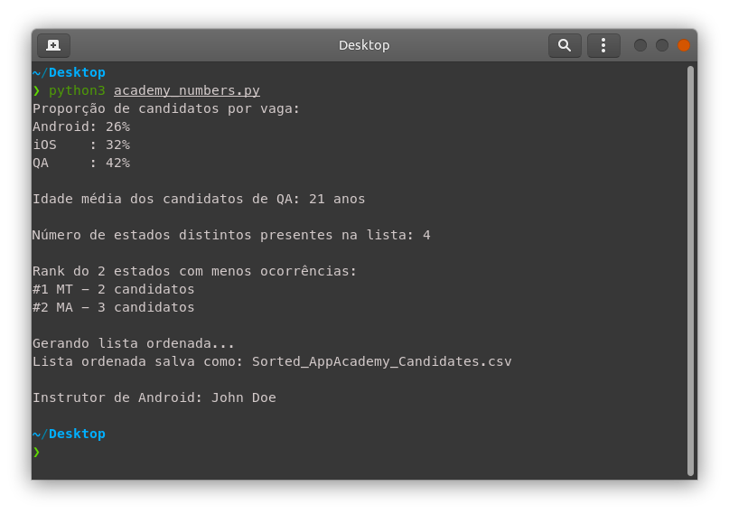

# AppAcademy Challenge

Bem vindo ao seu primeiro desafio do **AppAcademy**! Esperamos que seja o primeiro de muitos!

## Sobre o desafio 🎯

O programa de capacitação da **PremierSoft**, o **AppAcademy**, contou com diversas inscrições. Do norte ao sul do país, pessoas interessadas em ingressar na área de TI se manifestaram. Entender de onde vêm essas pessoas, qual vaga despertou mais interesse nelas e a faixa etária, são alguns dos números que podemos extrair desse programa.

Os números servem como indicadores para que possamos aperfeiçoar o **AppAcademy** nas suas futuras edições. Investir mais em regiões que tiveram uma taxa de adesão menor, seria uma das possíveis melhorias a se fazer. Porém, extrair esses indicadores pode ser algo repetitivo e que requer iterar sobre uma grande massa de dados.

Portanto, para simplificar a contabilização desses indicadores e possibilitar a realização dessa mesma tarefa nas futuras edições, foi idealizado um programa. Programa esse no qual resolvemos lançar o seu desenvolvimento como desafio do **AppAcademy**.

## Getting started ☕️

teste  Na pasta principal desse repositório há uma planilha chamada [**AppAcademy_Candidates.csv**](./AppAcademy_Candidates.csv). Essa planilha contém algumas informações básicas de alguns candidatos que se inscreveram para o **AppAcademy**. Lá você encontrará dados como **nome**, **vaga**, **idade** e **estado**. Para proteger a identidade dos participantes, os nomes foram gerados aleatoriamente. O seu programa deve consumir esses dados para atender os critérios descritos a seguir.

## O que precisamos que o programa faça ?

- mostrar a porcentagem de candidatos de **Android**, **iOS** e **QA**
- mostrar a quantidade de candidatos de **QA** com menos de 25 anos
- mostrar a quantidade de candidatos de **QA** com 26 anos ou mais
- mostrar o número de estados distintos presentes na lista
- mostrar a quantidade de candidatos inscritos em  **QA** que são de fora de Santa Catarina

## Pick your tool 👇

Aceitaremos apenas programas desenvolvidos nessas linguagens:
- Python
- Java
- JavaScript 
- Kotlin
- Swift
- C#

## Como o seu programa deve parecer ?

Não estamos avaliando interfaces gráficas nesse momento. Você pode entregar algo visualmente simples, contando que atenda os [critérios citados](#o-que-precisamos-que-o-programa-faça-).

Exemplo:

## Mais uma coisinha...

Gostariamos de testar também seus conhecimentos na linguagem de SQL. Por isso incluímos o nome da instrutora de QA do AppAcademy na planilha e queremos que você faça um select na tabela de Candidatos capaz de mostrar o nome da instrutora da vaga para qual você se inscreveu.

Para te ajudar, disponibilizaremos os seguintes fatos:

- a instrutora de QA está inscrita na vaga de QA.
- a instrutora de QA tem mais de 20 anos.
- a instrutora é de SC.
- o ultimo nome da instrutora termina com "ss".
- o nome da instrutora contém as vogais "ia" juntas.

## 🎉 Consegui! e agora !?

- revise o código
- deixe o mais **clean** possível
- teste o seu programa
- compacta (como **.zip**) a pasta contendo **APENAS** os arquivos fontes do seu programa
- Você pode entregar os comandos SQL utilizados em um TXT junto com os arquivos de desenvolvimento :)

Por fim, enviar um e-mail com a solução em anexo para [rh@premiersoft.net](mailto:rh@premiersoft.net). No título colocar:
> Desafio AppAcademy - {NOME_COMPLETO} - {VAGA}

Exemplo:
> Desafio AppAcademy - John Doe - QA

*GLHF*

## FAQ

Talvez essa possa ser a sua dúvida.

### Qual é o prazo para entregar a solução ?
> No máximo até 21/05/2021 às 23:59 (horário de brasília).

### Fiz uso de biblioteca(s) para criar o programa. Preciso incluí-las no aquivo ".zip" ?
> Todas as linguagens especificadas acima conseguem atender os requisitos do desafio sem a necessidade de biblioteca(s) de terceiros. Caso o propósito da biblioteca seja auxiliar em tarefas além das definidas como [requisitos desse programa](#o-que-precisamos-que-o-programa-faça-) (criação de interfaces gráficas, por exemplo), então você deve incluí-las junto ao seu arquivo **.zip** a ser enviado.

### Como faço para abrir o arquivo da planilha (.csv) ?
> O formato de arquivo **CSV** é bem simples e pode ser aberto com qualquer editor de texto. Também é possível abrir com o **Microsoft Excel**, **LibreOffice Calc** ou qualquer outro leitor de planilha.

### Os nomes na planilha estão aparecendo com caracteres estranhos, como "Otávio"
> O programa que você está usando para abrir a planilha esta abrindo o arquivo com o formato de texto ASCII. O formato certo para exibir as informações é UTF-8. Observe nesse conversor online o que acontece quando se converte texto em UTF-8 para ASCII: [Online ASCII Tools](https://onlineasciitools.com/convert-utf8-to-ascii?input=Ot%C3%A1vio).

### Os dados da planilha são reais ?
> Com exceção do nome dos inscritos, todos os demais dados são reais.

### Preciso atender todos os critérios antes de mandar a solução por e-mail ?
> Idealmente sim. Se você não conseguiu atender todos os critérios, tente mais uma vez. [usar atalho](#getting-started-%EF%B8%8F)

### Como faço pra tirar alguma dúvida sobre o desafio ?
> Você pode mandar um e-mail para [rh@premiersoft.net](mailto:rh@premiersoft.net).
